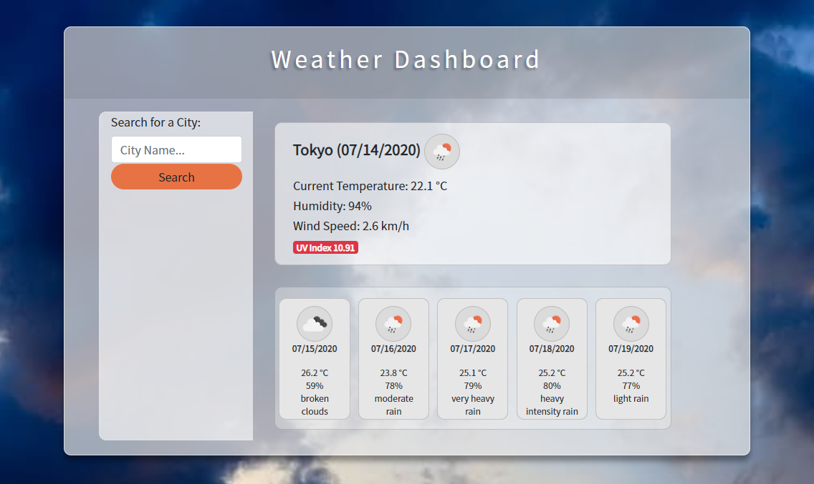

# Weather Dashboard
### Description
This application was designed with the intention of providing the user with a weather dashboard capable of detecting and displaying local weather, as well as accommodating search queries to display the weather conditions present in the desired locales. The goal of this project is to allow users to effectively plan their travels around the current and forecasted weather available in each location to optimize their trip. 

##### User Story
```
AS A traveler
I WANT to see the weather outlook for multiple cities
SO THAT I can plan a trip accordingly
```


### Table of Contents
- [Usage](#Usage) 
- [License](#License) 
- [Contributors](#Contributors) 
- [Tests](#Tests) 
- [Questions](#Questions) 

### Usage
In order to employ this application as effectively as possible, please access the deployed application here:    

Upon opening this application in your browser, you will be prompted to allow the application to access your location; in selecting "allow", you will allow the application to display your local weather. If you have recently searched a locale, the last item saved to your local storage will appear rather than the default local weather information.     
In order to perform a search, you will need to input a city name, and two-character city code in the indicated format, "City, CC" (Ex. Toronto, CA). When you subsequently click the "Seach" button below, the weather for the searched city will be generated and stored below so that you may access this city in order to compare search query results.

### License
[](https://opensource.org/licenses/MIT)

    Copyright (c) 2020 Christine Clemens

    Permission is hereby granted, free of charge, to any person obtaining a copy
    of this software and associated documentation files (the "Software"), to deal
    in the Software without restriction, including without limitation the rights
    to use, copy, modify, merge, publish, distribute, sublicense, and/or sell
    copies of the Software, and to permit persons to whom the Software is
    furnished to do so, subject to the following conditions:

    The above copyright notice and this permission notice shall be included in all
    copies or substantial portions of the Software.

    THE SOFTWARE IS PROVIDED "AS IS", WITHOUT WARRANTY OF ANY KIND, EXPRESS OR
    IMPLIED, INCLUDING BUT NOT LIMITED TO THE WARRANTIES OF MERCHANTABILITY,
    FITNESS FOR A PARTICULAR PURPOSE AND NONINFRINGEMENT. IN NO EVENT SHALL THE
    AUTHORS OR COPYRIGHT HOLDERS BE LIABLE FOR ANY CLAIM, DAMAGES OR OTHER
    LIABILITY, WHETHER IN AN ACTION OF CONTRACT, TORT OR OTHERWISE, ARISING FROM,
    OUT OF OR IN CONNECTION WITH THE SOFTWARE OR THE USE OR OTHER DEALINGS IN THE
    SOFTWARE.

### Contributors
There are currently no contributions to this project. If you would like to become a contributor, please contact me at the email address specified below!

### Questions
| Please direct your inquiries here! |
| :---: |
|  |
| <a href= "christineclemens.tesol@gmail.com" target="_blank">Contact Me</a> |
**This project was created by Christine Clemens.**     

**GitHub Repository:** https://github.com/ChristineClemens/WeatherDashboard     
**Deployed Application:** https://christineclemens.github.io/WeatherDashboard/Develop/index.html
